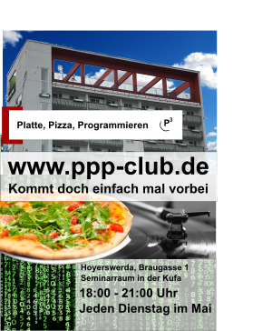

# Programmieren in Hoyerswerda

Ein Programmierclub in Hoyerswerda? Ja!

<a href="./assets/img/ppp-flyer.png"></a>

Der Name "Platte, Pizza, Programmieren" ist Programm. Wir werden gemeinsam in entspannter Atmosphäre programmieren. Dabei dürfen Getränke und Pizza nicht fehlen. Das Programmieren soll dabei durch erfahrene Entwickler lebendig werden und Jugendlichen näher gebracht werden.

Alle Interessierten sind herzlich eingeladen.

## Wo?

Im Seminarraum der [Kulturfabrik (Kufa) in Hoyerswerda](https://graphhopper.com/maps/?point=&point=51.438902%2C14.245647). Hoyerswerda ist auch [per Bus oder Bahn erreichbar](https://www.bahn.de) und vom Bahnhof sind es dann [noch eine 1/4 Stunde zu Fuß](https://graphhopper.com/maps/?point=Hoyerswerda%20Bahnhofsallee%201&point=Kulturfabrik%20Hoyerswerda&vehicle=foot).

Der Raum befindet sich links vor der Treppe in der Kulturfabrik ("Open Space").

## Wann?

Der PPP Club findet Dienstag von 15 bis 18 Uhr alle 2 Wochen statt:

Mai 2024
- 7.5. in der Kufa
- ~28.5. in der Kufa~

Juni 2024
- 04.6. in der Kufa
- 18.6. in der Kufa. Das letzte Mal. Good bye PPP Club!


## Wer?

Jugendliche und Erwachsene bis ins hohe Alter sind gern gesehene Gäste. Erwartet wird ein respektvoller Umgang miteinander.

### Who?

You don't speak German? No problem if you know a bit English! Join us and contact us if you have questions. You can copy and paste this text into [deepl.com](https://www.deepl.com)

## Kosten?

Die Veranstaltung ist für alle Teilnehmer kostenfrei.

## Was soll mitgebracht werden?

Nur ein Interesse an Computern oder Programmieren ist erforderlich. Falls vorhanden, kann auch der eigene Laptop mitgebracht werden.

## Welche Themen?

```js
// We want to have
var fun = function software(yourLang) {
  alert(yourLang)
}
```

Das Hauptthema ist die Softwareentwicklung und wie sie unser Zusammenleben auch hier in Hoyerswerda verbessern kann. Die Unterthemen werden durch die Teilnehmer festgelegt - zum Beispiel:

- Open Source Software
- Software für [OpenStreetMap](https://www.openstreetmap.org)
- Softwarenutzung in der Schule wie z.B. das [Bildungspaket von Digitalcourage](https://digitalcourage.de/kinder-und-jugendliche/bildungspaket).
- 'Neue' Programmiersprachen wie Kotlin ([coroutines](https://www.youtube.com/watch?v=hb0hfHVWCS0)!) oder Rust
- Spezial Routenplanungssoftware, wie z.B. [Routenplanung in Sorbisch](https://graphhopper.com/maps/?point=GraphHopper%20Hoyerswerda&point=Wittichenau&locale=hsb&layer=Sorbian%20Language)
- Software zur Verbesserung vom Nahverkehr benötigt [offene Daten](https://rettedeinennahverkehr.de/)
- [Calliope](https://calliope.cc) oder [ESP32](https://de.wikipedia.org/wiki/ESP32) Programmierung
- ...

## Projekte

- [Potat0Map](https://github.com/UnrealValentin/potato-maps)
- [socket test](https://github.com/karussell/socket-testing)
- [IoT test](https://github.com/karussell/iot-test) (via VSCode)
- Aufsetzen einer [BBB](https://github.com/bigbluebutton/bbb-install) Instanz für z.B. Fernunterricht
- Probiere andere [Webseite](https://github.com/Brandenburger-Maker/Brandenburger-Maker.github.io) als Grundlage für PPP
- telegram bot
- Mit godot game engine spielen
- Mit dem neuen "code with me Feature" von IntelliJ spielen

## Alte Versionen

Alte Versionen dieser Seite finden sich [hier](https://github.com/graphhopper/ppp-club/commits/master).

## Ähnliche Projekte in Hoyerswerda und Umgebung

Das Zuse-Computer-Museum bietet oft [interessante Veranstaltungen](https://zuse-computer-museum.com/angebote/veranstaltungen/) mit "Computer-Bezug" für Jung und Alt.

In Spremberg gibt es das Projekt ["Offene Werkstatt"](https://www.owspremberg.de).

Weitere ähnliche Projekte haben wir [hier](./similar-projects.html) aufgelistet.

## Berichterstattung über PPP

- [Mai 2019, Sächsische Zeitung](https://www.saechsische.de/programmier-club-startet-5066220.html)
- [Mai 2019, hoyte24.de](https://hoyte24.de/newsreader2/programmier-club-startet.html)
- [Juli 2019, Sächsische Zeitung](https://www.saechsische.de/plus/programmierclub-und-fabmobil-in-einem-hoyerswerda-5097719.html)
- [Juli 2019, Lausitzer Rundschau](https://www.lr-online.de/lausitz/hoyerswerda/das-fabmobil-bringt-die-zukunft-nach-hoyerswerda_aid-44292517)

## Since

2019 - 2023

## Kontakt / Impressum

Karich, Kirchstraße 17, 02977 Hoyerswerda

Email: peter-ppp@graphhopper.com
